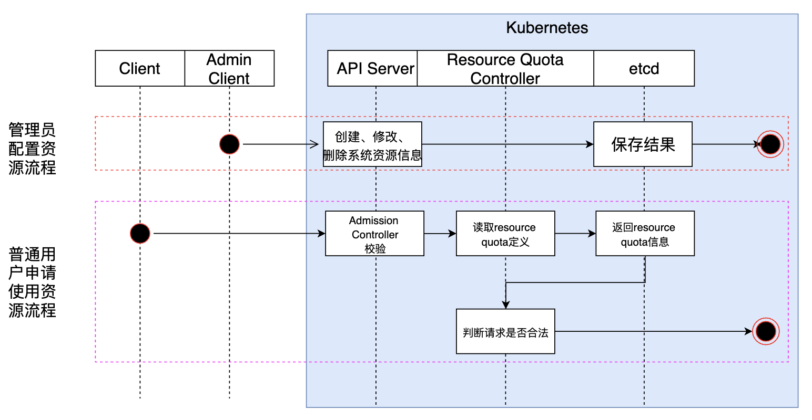

## Pod设计理念

Pod是k8s的逻辑概念，Pod类似为进程组，Pod中的container类似为进程，一个pod中的所有进程共享资源、紧密协作。容器本身是单进程模型，该进程就是应用进程。这样从外部就可以知道容器中的应用状态。容器如果是多进程，由一个主进程管理其它进程时，管理容器等于管理主进程而非应用本身。管理应用的生命周期会变得困难。


## 容器内使用pod信息

1. 通过环境变量

   ```yaml
   env:
     - name: NODE_NAME
       valueFrom:
         fieldRef:
           fieldPath: spec.nodeName # 根据配置层级用.引用
   ```

2. 通过配置文件

   ```yaml
   volumes:
     - name: podinfo
       downwardAPI: # 使用该API，支持pod和container的信息
         items:
           - path: "labels"
             fieldRef:
               fieldPath: metadata.labels
   ```


## Pod健康检查

有三类探针，

* LivenessProbe:判断是否存活，kubelet会重启不是存活的pod

* RedinessProbe：判断是否可用，service只有在readinessProbe为ready状态，才将该pod加到service的endpoint中，对外提供服务

* StartupProbe：有且仅有一次的超长启动延时

探针的实现方式：

* ExecAction：容器内部运行命令，返回码为0，代表健康

  ```yaml
  livenessProbe:
    exec:
      command:
      - cat
      - /tmp/health
  ```

* TCPSocketAction：通过容器IP+端口，执行TCP检查，能够建立TCP连接，则健康

  ```yaml
  livenessProbe:
    tcpSocket:
      port: 80
  ```

* HTTPGetAction:HTTP get响应状态码在200～400间，则认为容器健康

  ```yaml
  livenessProbe:
    httpGet:
      path: /health
      port: 80
    initialDelaySecondes: 30 # 容器首次健康检查等待时间
    timeoutSeconds: 1 #等待健康检查响应的时间
  ```

  

## 资源控制

支持管理的资源包括：CPU、Memory、ephemeral storage（临时存储）及扩展资源如GPU。扩展资源只能获取整数个资源。

containers下面resource中进行资源的request和limits配置

```yaml
apiVersion: v1
kind: Pod
metadata:
  name: test
spec:
  containers:
  - name: test
    image: busybox
    resources:
      request:
        memory: "64Mi"
        cpu: "250m"
        ephemeral-storage: "2Gi"
      limits:
        memory: "128Mi"
        cpu: "500m"
        ephemeral-storage: "4Gi"
```

### 资源Quota

限制每个Namespace资源用量，超出限制时，用户无法提交新建。ResourceQuota的工作机制如下：



```yaml
apiVersion: v1
kind: ResourceQuota
metadata:
  name: demo
  namespace: demo
spec:
  hard:
    cpu: "1000"
    memory: 200Gi
    pods: "10"
  
```


## Pod QoS服务质量

对 pod 的服务质量进行一个分类，分别是 Guaranteed、Burstable 和 BestEffort。

- Guaranteed ：pod 里面每个容器都必须有内存和 CPU 的 request 以及 limit 的一个声明，且 request 和 limit 必须是一样的，这就是 Guaranteed；保障资源
- Burstable：至少有一个容器存在内存和 CPU 的一个 request；弹性保证
- BestEffort：request/limit 都不填；尽力而为

系统用request进行调度的。cpu资源而言，系统会对Guaranteed的pod单独划分cpu资源，Burstable和BestEffort则共用cpu，按权重来使用不同的时间片。内存资源而言，会对pod划分OOMScore，score越高越先被kill掉。Guaranteed为固定-998，BestEffort为固定1000，Burstable则是根据内存大小和节点关系划分2～999。发生驱逐时，优先BestEffort。对相同服务质量的pod，OOMScore的基础分部分是内存使用百分比 * 1000，因此相同QoS的前提下优先kill使用内存百分比高的。


## Pod的调度

#### Pod亲和调度

1. PodAffinity
   * requireDuringSchedulingIgnoredDuringExecution：强制亲和（调度时，执行亲和校验；运行时，若标签发生变化导致的亲和变化则忽略）

   * preferredDuringSchedulingIgnoredDuring Execution：优先亲和

   ```yaml
   affinity：
     podAffinity:
       requireDuringSchedulingIgnoredDuringExecution:
       - labelSelector:
         matchExpressions:
         - key: security
           operator: In # 操作符：In，NotIn，Exists, DoesNotExist,Gt,Lt
           values:
           - S1	
         topologyKey: kubernetes.io/hostname #设置拓扑域，默认的还有topology.kubernetes.io/region,topology.kubernetes.io/zone
   ```

2. podAntiAffinity
   * requireDuringSchedulingIgnoredDuringExecution：强制反亲和

   * preferredDuringSchedulingIgnoredDuring Execution：优先反亲和

#### Node亲和调度

1. NodeSelector：强制调度到指定节点

2. NodeAffinity

   * requireDuringSchedulingIgnoredDuringExecution强制亲和

   * preferredDuringSchedulingIgnoredDuring Execution：优先亲和

3. Taint：一个node可以有多个taints

   1. 行为模式有：

      - PreferNoSchedule：尽量不调度来
      - NoSchedule：禁止pod调度来
      - NoExecute：驱逐没有toleration的pod，并禁止调度新的

      ```yaml
      apiVersion: v1
      kind: Node
      metadata:
        name: demo
      spec:
        taints:
        - key: "k1"
          value: "v1"
          effect: "NoSchedule"
      ```

   2. Pod的tolernation，只有设置对应的toleration才能调度到有相应taint的Node上

      ```yaml
      apiVersion: v1
      kind: Pod
      metadata: 
        namespace: demo
        name: demo
      spec:
        containers:
        - image: busybox
          name: demo
        tolerations:
        - key: "k1"
          operator: "Equal"
          value: "v1"       #当op=Exist，可以为空
          effect: "NodSechedule" #可以为空，匹配所有
          tolerationSeconds: 3600 #taint添加后，pod还能再node上运行时间
      ```
      


### 优先级调度

kubelet会根据pod配置的priority，得分高的会对优先级低的进行资源抢占

1. 使用PriorityClass创建优先级, pod中通过priprityClassName引用相应优先级

   ```yaml
   apiVersion: v1
   kind: PriorityClass
   metadata:
     name: high
   value: 1000
   globalDefault: false
   ```

2. 系统默认优先级

   1. 没有设置均为0
   2. 用户可配置最大优先级为10亿，系统级别优先级为20亿
   3. 内置系统优先级：system-cluster-critical，system-node-critical


### pod调度过程

用户提交yaml文件，webhook controller会先对文件进行校验，校验成功后，api server会创建pod对象，此时pod的node名称为空。kube scheduler会watch到pod的创建、同时发现node名称为空，会进行查找合适的node，并修改pod名称为相应的node名。相应节点上的kubelet watch到pod需要创建，会在节点上创建容器和网络。


## 其它

### InitContainer

比普通容器先启动，执行成功后普通才能启动；且是顺序执行的，普通容器可以并发启动。

### Sidecar 容器设计模式

用一个辅助容器做辅助工作，如日志收集、debug、前置操作等。好处：对业务代码没有侵入；功能解耦，共享。模式包括：

* 代理模式：代理网络等
* 适配器模型：适配不同外部需求

### Pod容灾

```yaml
topologySpreadConstraints:
  - topologyKey: address
    maxSkew: 1  #用于指明pod在各个zone中容忍的最大不均匀数；值越小每个zone中pod分布越均匀
    whenUnsatisfiable: DoNotSchedule
    labelSelector:
      matchLabels:
        app: myapp
```

