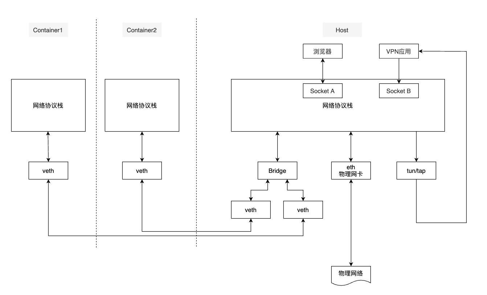

## 物理网络设备

### 集线器

工作在物理层，没有隔离和过滤功能。网络是广播的方式

### 网桥

可以将网络的多个网段在数据链路层连接起来的网络设备，其工作原理是在L2数据链路层根据MAC地址进行过滤和转发，常用于连接两个不同的网段。

### 交换机

功能强大的网桥

### 路由器

工作在网络层，根据网络地址，过滤、分隔网络信息流、连接网络分支。主要用于广域网与局域网的连接

### 网关

把信息重新包装，以适应目标环境要求

## 虚拟网络相关

### 网络命名空间

不同命名空间网络栈完全隔离，命名空间中包括：独立路由表、独立iptables、NAT、IP包过滤、进程、套接字、网络设备。网络设备属于公共资源，通过修改属性在各个命名空间移动。

### veth

成对出现，并连接在一起；数据从协议栈接收到数据后，会发送到另一台设备上。命名空间通过Veth进行通信。

### Bridge

网桥会将接收到的数据与自己保存的MAC地址表比较，查询数据应该转发的地方；当MAC地址表数据失效后，就需要广播的方式更新数据。虚拟网桥被用来连接单台物理机内的物理网卡和其它虚拟网络设备。

### TUN/TAP

TUN和TAP是由纯软件实现的Linux内核虚拟网络设备，是一种以太网设备，TUN和TAP包含字符设备驱动和网卡驱动两部分，其中字符设备驱动是模拟物理链路的数据接受和发送，网卡驱动是接受来自tcp/ip协议栈的网络分包并发送，常用于加密、VPN、隧道、虚拟机等

### iptables和Netfilter

Linux网络协议栈中回调函数挂载点的实现包括iptables和netfilter，netfilter负责内核中执行各种挂接规则，运行在内核模式下。iptables在用户模式下，协助和维护内核中netfilter的各种规则表。

### 路由

Linux的路由功能是通过路由表来实现的，IP层在处理和转发数据时，会根据路由表记录的目的IP与下一个路由IP关系，进行数据的转发。