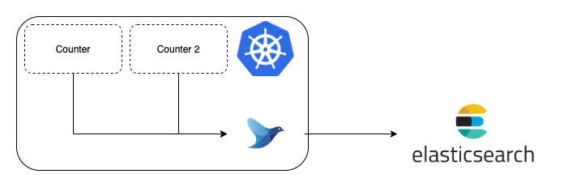

## 监控

k8s监控有三种接口：

* Resource Metrics

  对应的接口是 metrics.k8s.io，主要的实现就是 metrics-server，它提供的是资源的监控，比较常见的是节点级别、pod 级别、namespace 级别、class 级别。这类的监控指标都可以通过 metrics.k8s.io 这个接口获取到。

* Custom Metrics

  对应的 API 是 custom.metrics.k8s.io，主要的实现是 Prometheus。它提供的是资源监控和自定义监控，资源监控和上面的资源监控其实是有覆盖关系的，而这个自定义监控指的是：比如应用上面想暴露一个类似像在线人数，或者说调用后面的这个数据库的 MySQL 的慢查询。这些其实都是可以在应用层做自己的定义的，然后并通过标准的 Prometheus 的 client，暴露出相应的 metrics，然后再被 Prometheus 进行采集。

* External Metrics

  external.metrics.k8s.io。主要的实现厂商就是各个云厂商的 provider，通过这个 provider 可以获取云资源的监控指标。

## 日志

fluentd以sidecar模式收集日志存储到elasticsearch，再在Kibana中展示



## 审计

API Server在启动时配置--feature-gates=AdvancedAuditing=true，开启高级审计日志特性，用来记录请求相关信息用于安全审计。

每个请求发生过程中有如下几个阶段的信息可以被记录：

- `RequestReceived` - 此阶段对应审计处理器接收到请求后，并且在委托给 其余处理器之前生成的事件。
- `ResponseStarted` - 在响应消息的头部发送后，响应消息体发送前生成的事件。 只有长时间运行的请求（例如 watch）才会生成这个阶段。
- `ResponseComplete` - 当响应消息体完成并且没有更多数据需要传输的时候。
- `Panic` - 当 panic 发生时生成。

### 审计策略 

审计策略定义了应记录哪些事件以及应包含哪些数据。 审计级别表示记录什么样的数据，已定义的审计级别有：

- `None` - 符合这条规则的日志将不会记录。

- `Metadata` - 记录请求的元数据（请求的用户、时间戳、资源、动词等等）， 但是不记录请求或者响应的消息体。

- `Request` - 记录事件的元数据和请求的消息体，但是不记录响应的消息体。 这不适用于非资源类型的请求。

- `RequestResponse` - 记录事件的元数据，请求和响应的消息体。这不适用于非资源类型的请求。

  ```yaml
  apiVersion: audit.k8s.io/v1 # This is required.
  kind: Policy
  # Don't generate audit events for all requests in RequestReceived stage.
  omitStages:
    - "RequestReceived"
  rules:
    # Log pod changes at RequestResponse level
    - level: RequestResponse
      resources:
      - group: ""
        # Resource "pods" doesn't match requests to any subresource of pods,
        # which is consistent with the RBAC policy.
        resources: ["pods"]
    # Log "pods/log", "pods/status" at Metadata level
    - level: Metadata
      resources:
      - group: ""
        resources: ["pods/log", "pods/status"]
  
    # Don't log requests to a configmap called "controller-leader"
    - level: None
      resources:
      - group: ""
        resources: ["configmaps"]
        resourceNames: ["controller-leader"]
  
    # Don't log watch requests by the "system:kube-proxy" on endpoints or services
    - level: None
      users: ["system:kube-proxy"]
      verbs: ["watch"]
      resources:
      - group: "" # core API group
        resources: ["endpoints", "services"]
  
    # Don't log authenticated requests to certain non-resource URL paths.
    - level: None
      userGroups: ["system:authenticated"]
      nonResourceURLs:
      - "/api*" # Wildcard matching.
      - "/version"
  
    # Log the request body of configmap changes in kube-system.
    - level: Request
      resources:
      - group: "" # core API group
        resources: ["configmaps"]
      # This rule only applies to resources in the "kube-system" namespace.
      # The empty string "" can be used to select non-namespaced resources.
      namespaces: ["kube-system"]
  
    # Log configmap and secret changes in all other namespaces at the Metadata level.
    - level: Metadata
      resources:
      - group: "" # core API group
        resources: ["secrets", "configmaps"]
  
    # Log all other resources in core and extensions at the Request level.
    - level: Request
      resources:
      - group: "" # core API group
      - group: "extensions" # Version of group should NOT be included.
  
    # A catch-all rule to log all other requests at the Metadata level.
    - level: Metadata
      # Long-running requests like watches that fall under this rule will not
      # generate an audit event in RequestReceived.
      omitStages:
        - "RequestReceived"
  
  ```

  