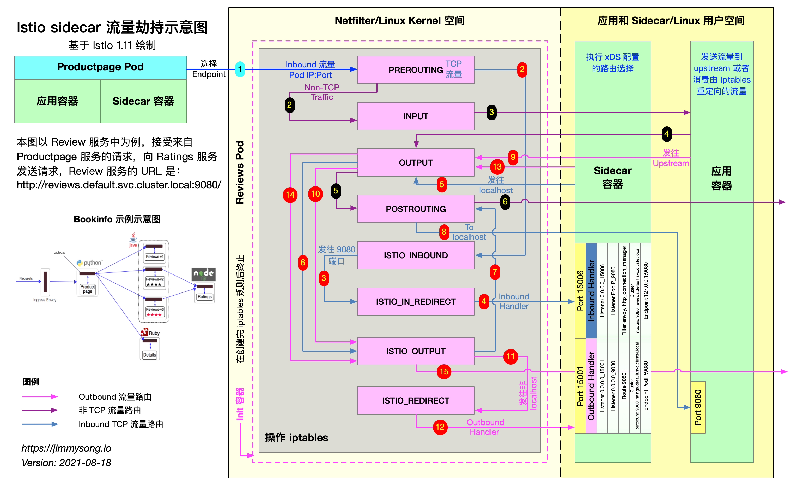
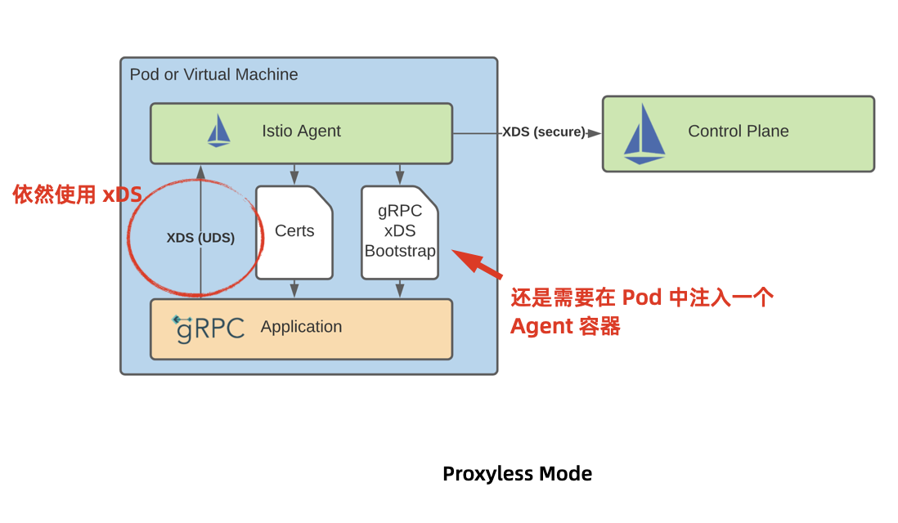

# 作用

* 控制服务间的流量和API调用过程，实现A/B测试、金丝雀发布、按流量百分比分阶段发布
* 提供了安全的通信通道
* 提供对所有服务性能的可视化能力

# Istio 架构

在服务网格概念兴起之初就有 Per-node 和 Sidecar 模式之争，他们的代表分别是 Linkerd 和 Istio。后来 eBPF 提出将服务网格下沉的内核，从而演化出了更多的服务网格部署模式。

## 服务网格的部署模式

这四种模式分别是Sidecar 代理、节点共享代理、Service Account/节点共享代理、带有微代理的共享远程代理。

这几种架构模式的主要区别是代理所在的位置不同，模式一在每个应用程序旁运行一个代理，模式二在每个节点上运行一个代理，模式三在每个节点中，再根据 ServiceAccount 的数量，每个 ServiceAccount 运行一个代理，模式四在每个应用旁运行一个微代理，这个代理仅处理 mTLS ，而七层代理位于远程，这几种方式在安全性、隔离及运维开销上的对比如这个表格所示。

| **模式**                         | **内存开销**                                                 | **安全性**                                                   | **故障域**                                                   | **运维**                                                  |
| -------------------------------- | ------------------------------------------------------------ | ------------------------------------------------------------ | ------------------------------------------------------------ | --------------------------------------------------------- |
| **Sidecar 代理**                 | 因为为每个 pod 都注入一个代理，所以开销最大。                | 由于 sidecar 必须与工作负载一起部署，工作负载有可能绕过 sidecar。 | Pod 级别隔离，如果有代理出现故障，只影响到 Pod 中的工作负载。 | 可以单独升级某个工作负载的 sidecar 而不影响其他工作负载。 |
| **节点共享代理**                 | 每个节点上只有一个代理，为该节点上的所有工作负载所共享，开销小。 | 对加密内容和私钥的管理存在安全隐患。                         | 节点级别隔离，如果共享代理升级时出现版本冲突、配置冲突或扩展不兼容等问题，则可能会影响该节点上的所有工作负载。 | 不需要考虑注入 Sidecar 的问题。                           |
| **Service Account/节点共享代理** | 服务账户/身份下的所有工作负载都使用共享代理，开销小。        | 工作负载和代理之间的连接的认证及安全性无法保障。             | 节点和服务账号之间级别隔离，故障同“节点共享代理”。           | 同“节点共享代理”。                                        |
| **带有微代理的共享远程代理**     | 因为为每个 pod 都注入一个微代理，开销比较大。                | 微代理专门处理 mTLS，不负责 L7 路由，可以保障安全性。        | 当需要应用7层策略时，工作负载实例的流量会被重定向到L7代理上，若不需要，则可以直接绕过。该L7代理可以采用共享节点代理、每个服务账户代理，或者远程代理的方式运行。 | 同“Sidecar 代理”。                                        |

Istio 架构目前来说有两种，一种是 Sidecar 模式，另一种是 Proxyless 模式。

## Sidecar 模式

Sidecar 模式是 Istio 开源之初就在使用的模式，这种模式将应用程序的功能划分为单独的进程运行在同一个最小调度单元中，比如 Kubernetes 的 Pod 中。这种架构分为两个部分：控制平面和数据平面，控制平面是一个单体应用 Istiod，数据平面是由注入在每个 Pod 中的 Envoy 代理组成。你可以在 Sidecar 中添加更多功能，而不需要修改应用程序代码。这也是服务网格最大的一个卖点之一，将原先的应用程序 SDK 中的功能转移到了 Sidecar 中，这样开发者就可以专注于业务逻辑，而 sidecar 就交由运维来处理。

我们在看下应用程序 Pod 中的结构。Pod 中包含应用容器和 Sidecar 容器，sidecar 容器与控制平面通信，获取该 Pod 上的所有代理配置，其中还有个 Init 容器，它是在注入 Sidecar 之前启动的，用来修改 Pod 的 IPtables 规则，做流量拦截的。

## Proxyless 模式

Proxyless 模式可以直接将 gRPC 服务添加到 Istio 中，不需要再向 Pod 中注入 Envoy 代理。这样做可以极大的提升应用性能，降低网络延迟。有人说这种做法又回答了原始的基于 SDK 的微服务模式，其实非也，它依然使用了 Envoy 的 xDS API，但是因为不再需要向应用程序中注入 Sidecar 代理，因此可以减少应用程序性能的损耗。但，应用需要进行改造。

